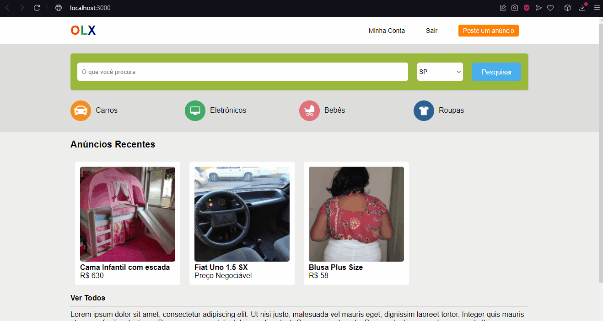

<h1>Clone OLX</h1>

<h2>Sobre</h2>

<p>Cópia praticamente completa da OLX. Filtrado por tipo de produtos, e pela barra de pesquisa. </br>
Sistema de Cadastro e Login, adicionar anúncios e opção de alterar os mesmos. Possuí apresentação em slides e paginação. </br> Site responsivo.
</p>

### Features
- [x] Inserir novos anúncios
- [x] Encontrar anúncios pela barra de pesquisa
- [x] Anúncios filtrados por gêneros
- [X] Área de Login e Cadastro
- [x] Área Minha Conta, onde é possível alterar dados de seus anúncios e da sua conta (área feita por mim)
- [x] API com diversas requisições (exibir anúncios, categorias, dados de conta, cadastro e etc), dos métodos POST, GET e PUT
- [x] Totalmente responsivo

<h1>
    
</h1>
<h1>
    
</h1>
<h1>
    
</h1>
<h1>
    
</h1>
<h1>
    
</h1>
<h1>
    
</h1>

### Pré-requisitos
Antes de começar, você vai precisar das seguintes ferramentas: [Git](https://git-scm.com), [Node.js](https://nodejs.org/en/) e um editor de código, como o [VSCode](https://code.visualstudio.com/)

### Rodando o projeto
```bash
# Clone este repositório
git clone https://github.com/MalcolmMello/olxclone
# Acesse a pasta do projeto pelo seu terminal
cd olxclone

# Instale as dependências
npm install

# Inicie a aplicação
npm start

# O servidor irá rodar na porta:3000 - acesse <http://localhost:3000>

```

### Tecnologias
- React
- Styled-components
- Router
- API 

---

Feito no curso B7Web - Área minha conta feita por mim (requisições, exibição e responsividade) - [Meu LinkedIn](https://www.linkedin.com/in/malcolm-de-mello-a8208a224/)